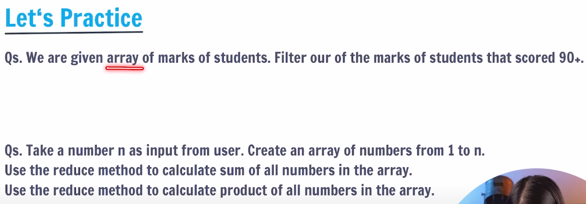

## 01-Print
To print content in js we use below syntax 
```js
console.log("Hello world");
```

## 02-Variables in js
- variables are containers for data.
- variables are anything which can be changed.
- eg: radius, length, age etc

```javascript
radius = 15;
console.log("Radius of a circle: ",radius);
console.log("Area of circle is: ", 3.14*radius*radius);
``` 

- In variables we generally define the **null** and **undefined** value.
- null: nothing is present
- undefined: don't know what is present
```js
x=null;
y=undefined;
console.log(x,y);
```

### Variable rules
- Variable names are case sensitive: 'a' and 'A' are diffrent.
- Only letters, digit, underscore(_), and $ is allowed. (not even space).
- Only a letter, underscore(_) or $ should be 1st character.
- Reserved words cannot be variable names.

### Note:
- Js is dynamically typed language.
- Always give variable name where, From variable we can identify the variable use.
- eg: fullname, age, radius, etc.

## let, const & var
- In variable declaration we should always use below reserved key.
- var: Variable can be re-declared & updated. A global scope variable.

```js
    var age=50;
    var age=60;
    console.log(age);
```
- let: Variable cannot be re-declared but can be updaated. A block scope variable.
```js
    let rad = 20;
    rad = 30;
    // let rad=50; this will throw error
    console.log(rad);
```
- const: Variable cannot be re-declared or updated. A block scope varible.
```js
    const z=2;
    // z=3; this will throw error bcoz we can't update const variable
    console.log('z= ',z);
```

### Note
- In todays time we should never use the var because it can re-declared and updated because that we won't know if we ever intialized same named variable or not.

## 03-Datatypes in js
- Whatever we declare in js it is assign with the some kind of datatypes.
- Primitive datatype: number, string, boolean, undefined, Null, BigInt, symbol
- Non-primitive datatype: combination of primitive datatypes(objects). eg: array, functions etc.
- syntax to create non-primitive datatype
```js
// creation of objects
    const student = {
        fullname: 'Anuj kumar',
        age: 22,
        cgpa: 7.34,
        isPass: true
    }
    console.log('Details of student: ', student);
```
- syntax to know the datatype of variable is :
```js
    typeof var_name;
 ```


## 04-Comments in js
- This line of code is never get executed.
```js
// this is a single line comment
/*
this is a a 
multi line comment.
*/
```

## 05-Operators in js
- used to perform some operation on data.
- **Arithmetic Operators**: +, -, *, /
- Modulus(remainder)- %
- Exponentiation(power): ** 
- Increment
- Decrement
- eg:
```js
//operator in js
    let a=5;
    let b=6;

    // arithmetic operator
    console.log('a+b= ',a+b);
    console.log('a-b= ',a-b);
    console.log('a*b= ',a*b);
    console.log('a/b= ',a/b);

    // exponential and modulus
    console.log('a**b= ',a**b);
    console.log('a%b= ',a%b);

    // uinary operator
    // increment
    console.log('++a= ',++a); //pre increment o/p:6
    a=5;
    console.log('a++= ',a++); //post increment o/p:5
    // decrement
    a=5;
    console.log('--a= ',--a); //pre decrement o/p:4
    a=5;
    console.log('a--= ',a--); //post decrement o/p:5
```

- **Assignment operators**: =, +=, -=, *=, /=, %=, **=
```js
    // Assignment operators
    let x=2;
    console.log('x= ',x);
    // x+=2 is same as x=x+2
    console.log('x+=2= ',x+=2);
    // x-=2 is same as x=x-2
    console.log('x-=2= ',x-=2);
    // x*=2 is same as x=x*2
    console.log('x*=2= ',x*=2);
    // x/=2 is same as x=x/2
    console.log('x/=2= ',x/=2);
    // x%=2 is same as x=x%2
    console.log('x%=2= ',x%=2);
    // x**=2 is same as x=x**2
    console.log('x**=2= ',x**=2);
```
- **Comparison operators**: ==(equal to), ===(equal to & type), !=(not equal to), !==(not equal to & type)
```js
    // Comparision operators
    let y=2;
    console.log(x,'==',y,":",x==y);
    console.log(x,'!=',y,":",x!=y);
    console.log(x,'===',y,":",x===y);
    console.log(x,'!==',y,":",x!==y);
```
- **Logical operators**: &&(and), ||(or), !(not)
| a | b | &&(and) |!(not) | \| \| |(or) | 
|---|---|---------|--------|-------|
|true|true|true|false|true|
|true|false|false|true|true|
|false|true|false|true|true|
|false|false|false|true|false|
```js
    // logical operator
    x=1;
    y=0;
    console.log(x,'&&',y,":",x&&y);
    console.log(x,'||',y,":",x||y);
    console.log('!',y,":",!y);
```
## 06-Conditional statements
- To implement some condition in the code
- if, else, else if
```js
    // conditional statements
    // if
    x=10;
    y=20;
    if(x>y){
        console.log('x is greater than y');
    }
    // else
    if(x<y){
        console.log('x is less than y');
    }
    else{
        console.log('x is greater than y');
    }
    // else if
    if(x<y){
        console.log('x is less than y');
    }
    else if(x>y){
        console.log('x is greater than y');
    }
    else{
        console.log('x is equal to y');
    }
```
- **Ternary operators**: condition?true output:false output
```js
    // ternary operator
    x=10;
    y=20;
    console.log(x>y?'x is greater than y':'x is less than y');
```
- **switch statement**
```js
    // switch
    x=10;
    y=20;
    switch(x){
        case 10:
            console.log('x is 10');
            break;
        case 20:
            console.log('x is 20');
            break;
        default:
            console.log('x is not present');
    }
```

## Loops in js
- Loops are used to execute a piece of code again and agian.
```js
    // for loops in js
    for(let i=1;i<=5;i++){
        console.log("anuj");
    }

    // while loop in js
    let i=0;
    while(i<5){
        console.log(++i);
    }

    // do while loop
    i=0;
    do{
        console.log(++i);
    }while(i<5);

    // for-of loop 
    let str='helloWorld'
    for(let i of str){
        console.log('i=',i);
    }
```
- In do while loop it will always run at least one time.
- We use **for-of** loop to iterate over each and every index in string, array and other datatypes.
- As we can see in the above code we are itrating over each and every char of string "helloWorld".
- we don't use for-of for the object datatypes.
- So to itrate over the object we use **for-in** loop

```js
    // for-in loop
    let _student= {
        name: 'Anuj kumar',
        age: 23,
        cgpa: 7.34
    };

    for(let key in _student){
        console.log('key = ',key,",value = ", _student[key]);
    }
```

Q1. Print all even number between 0 to 100.
```js
    for(let i=0;i<=100;i++){
        if (i%2==0){
            console.log(i);
        }
    }
```

Q2. Create a game where you start with any random game number. Ask the user to keep guessing the game number until the user enter correct value.
```js
    let gameNumber = 25;
    let userGuessNum = prompt("Guess the game number: ");
    while(gameNumber != userGuessNum){
        userGuessNum = prompt("Guess the game number again: ");
    }
    if (gameNumber==userGuessNum){
        console.log("Congratulation, you have guessed the right game number.");
    }
```

## Strings in js
- String is a sequence of characters used to represent text.
- **Create String**:```js let str="Hello world"```.
- **String length**:```js str.length```.
- **String Indices**:```js str[0], str[1]```.

## Template Literals in js
- A way to have embedded expression in strings.
- **String Interpolation**: To create strings by doing substitution of placeholders.
```js
    // template literals in js
    let specialString=`this is a special type of string`
    console.log(specialString);
    console.log("type of specialString: ",typeof specialString);
```
- The reason why we use template literals in js is to use the variables(expresion), inside this string. eg:
```js
    console.log(`Hi my name is ${_student.name} and i have the cgpa of ${_student.cgpa}`);
```

## String methods in js
- These are built-in functions to manipulate a string.
```js
    str.toUpperCase()
    str.toLowerCase()
    str.trim() // removes whitespaces.
    str.slice(start,end?) // returns part of stirng, end is non-excusive
    str.concat(str2) //joins str2 with str
    str.replace(searchval, newVal)
    str.chatAt(idx)
```

Q1. Prompt the user to enter their full name.Generate a username for them based on the input. Start username with @,followed by their full name and ending with the fullname length.
eg: user name="shardhakhapra", username should be"@shradhakhapra13”
```js
    let fullname = prompt("Enter your full name");
    updatedfullname = fullname.trim();
    let len = fullname.length
    console.log(`Your generated username is @${updatedfullname.concat(len)}`);
```

## Arrays in js
- Collections of items in a linear form
- **Create array**: ```js let heroes=['ironman', 'hulk', 'thor']```\
```js let info=['anuj', 23, 'bihar']```.
- Array: mutables
- string:immutables
### Looping over the array
```js
    // arrays in js
    let marksList = [50,60,70,80,90];
    // looping over markslist
    for(let i=0;i<marksList.length;``i++){
        console.log(marksList[i]);
    }
```

Q. For a given array with marks of students -> [85,97,44,37,76,60]. Find the average marks of the entire class.

Q.For a given array with prices of 5 items -> [250,645,300,900,50].All items have an offer of 10% OFF on them. Change the array to store final price after applying offer.

## Array method 
- push(): add to end
- pop(): delete from end and return
- toString(): converts array to string
- concat(): joins two arrays by creating new array.
- unshift(): add to start
- shift(): delete from start and return.
- slice(): returns a peice of the array. ```js arr.slice(startidx, endidx); ```
- splice(): change original array(add, remove, replace) ```js splice(startidx, delCount, newE(1...)); ```

## Functions and methods
- It is a block of code that performs a specific task, can be invoked/call whenever needed.
- **Function definition**
```js
    // functions and methods
    function add(a, b){
        console.log(a+b);
    }
    add(33,2);

    // syntax
    // Type-01
    // function functionName(){
    //     //some code
    // }
    // Type-02
    // function functionName(param1, param2, ...){
    //     // some code
    // }
```
- **Function call**:
```js
    // function call
    // functionName();
```
- **Arrow function**:
```js
// arrow function
    const sum = (a,b) => {
        console.log(a+b);
    }

    console.log(sum);
    sum(3,28);
```
Q.Create a function using the "function" keyword that takes a String as an argument &returns the number of vowels in the string.
```js
    function vowelsCount(str){
        let vowelList = ['a','e','i','o','u'];
        // making string into lowercase
        let ans=0;
        str=str.toLowerCase();
        for(let val of str){
            for(let v of vowelList){
                if(val==v){
                    ans++;
                }
            }
        }
        return ans;
    }

    console.log("helo",vowelsCount('Helloworld'));
```
Q.Create an arrow function to perform the same task.
```js

```

## forEach loop in arrays
```js
    arr.forEach(callBackFunction);
```
- **CallBackFunction**: here, it is a function to execute for each element in the array.
- A callback is a function passed as an argument to another function
```js
    arr.forEach((val) => {
        console.log(val);
    })
```
- In forEach method we can use three parameter: val, idx, arr

Q. For given array of numbers, print the square of each value using the forEach loop.
```js
    arr.forEach(val => {
        console.log(val);
    })
```

Q. Calculate the square for the each element in an array.
```js
    const calSq = (val) => {
        console.log(val**2);
    }

    arr.forEach(calSq);
```
- **Some more array methods**
1. Map: Creates a new array with the results of some operation. The value its callback returns are used to form new array.
```arr.map(callbackfnx(value, index, array))```
```js
    let newArr = arr.map((val) => {
        return val*2;
    })
```
2. Filter: Creates a new array of elements that give true for a condition/filter.
<br>eg: all even elements
```js
    let newArr = arr.filter( (val) => {
        return val%2 === 0;
    })
```

3. Reduce: Performs some operations and reduces the array to a single value. It returns that single value.
```js

```
